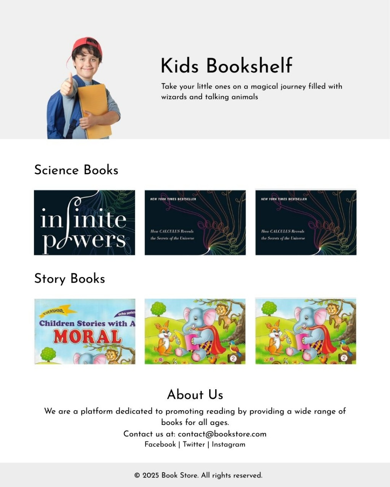

# Web Development Task

In this task, you'll learn about web development by creating a responsive book selling landing page.

## Before proceeding to the task

Now, anytime any changes take place in the main repository, your forked repository must pull those changes from the main repository before it can push other changes to the main repository.

1. Go to the [Enigma repository](https://github.com/EnigmaVSSUT/Induction-2025) and copy the repo address just like you copied your forked repo's address in task 1.

2. Open gitbash in your cloned repo and type:

```
git remote add upstream <copied repo address>
```

This adds a reference to the main repository from which we can pull the updates.

3. Now enter:

```
git pull upstream main
```

This should now pull all the changes that have been made to the main repo from merging the pull requests.

---

# Task

Welcome to your **first task** in the Web Development domain of **Enigma**!
Your challenge is to **create a simple, responsive book selling landing page** using just **HTML and CSS**.

## Objective

Build a clean and responsive **landing page** for a book-selling platform.  
This task will test your fundamentals in HTML, CSS, layout design, and responsiveness.

## Page Structure & Sections

Your webpage should include the following:

### 1. Hero Section

- A catchy heading introducing the platform
- A short description or tagline
- Keep it minimal and attractive

### 2. Science Books Section

- Showcase science books in a **Grid** or **Flexbox** layout
- Each book can have an image, title, and short description

### 3. Story Books Section

- Same as the science section, but for storybooks
- Keep the layout consistent with the science section

### 4. About Us Section

- A short paragraph describing the platform or brand

### 5. Footer

- Add contact information
- Include social media links (icons or simple text)
- A copyright notice
  
### 7. Submit

 - Now add, commit and push the changes just like you did in task 1 and create a pull request.
 
---

## Reference Image

 <p align="center"> 
        
   </p>

---

## Requirements

- ✅ **Use only HTML and CSS** (No JavaScript)
- ✅ Must be **responsive** on mobile, tablet, and desktop
- ✅ Use **CSS Flexbox or Grid** to create layouts
- ✅ Design should be **visually clean** and **well-aligned**
- ✅ Follow proper structure: use semantic HTML (like `<section>`, `<footer>`, etc.)

## Bonus Points

Want to stand out? Try adding:

- ⭐ **Hover effects** on buttons, images, or links
- ⭐ **Fixed navigation bar** at the top for smooth UX
- ⭐ Smooth scroll or section links (without JS)

## Submission Guidelines

- Create a new GitHub repository
- Deploy your website using one of these platforms:
  - GitHub Pages
  - Netlify
  - Vercel
  - Or any other deployment platform of your choice
  - Try to deploy your website on all these platforms (As it will make your stand out of the crowd)
- Inside the 'Web Development>Task' folder create a folder of your name. Inside the folder add your source code and a file named 'link.txt' containing hosted link of your website .

## Final Note

This task is meant to be **fun and creative**. Don't stress perfection — focus on learning and experimenting with layouts and responsive design. We're excited to see what you build! 🔥

> "Start where you are. Use what you have. Do what you can." – Team Enigma 💚

📁 Happy Coding & Good Luck!
